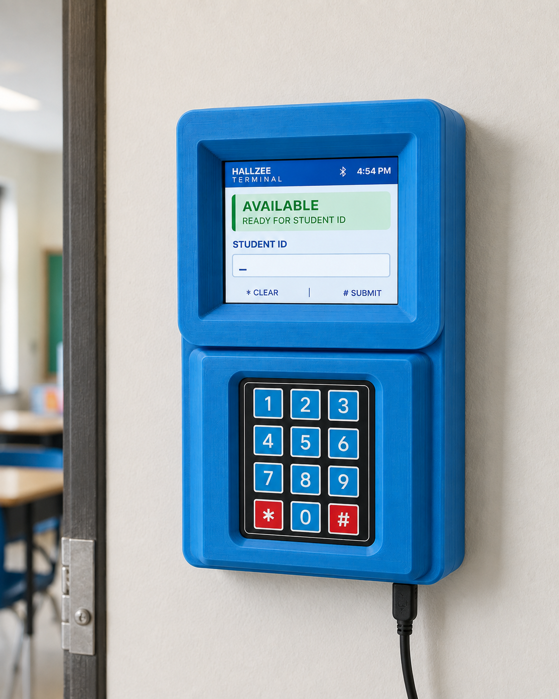
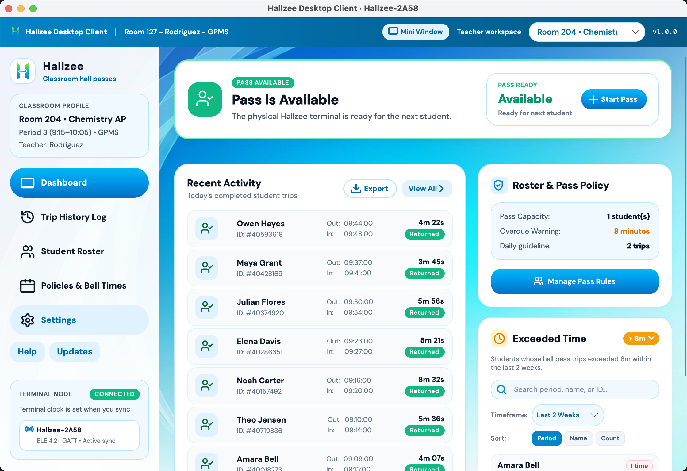
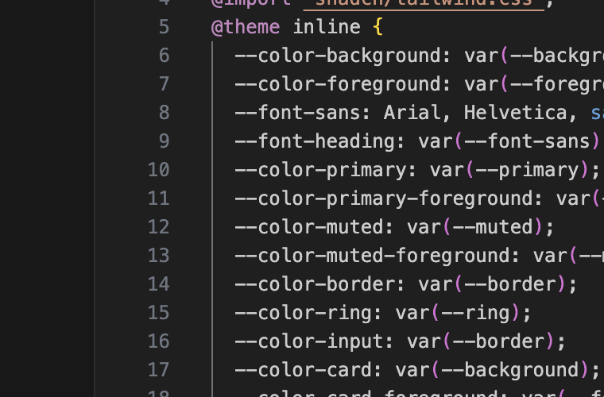
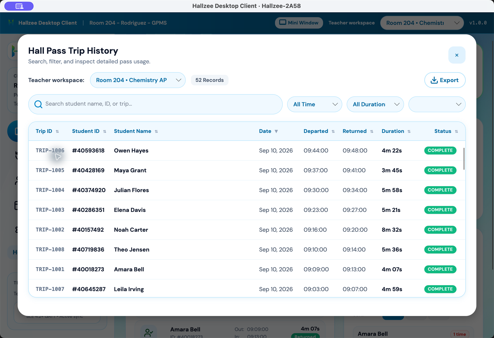
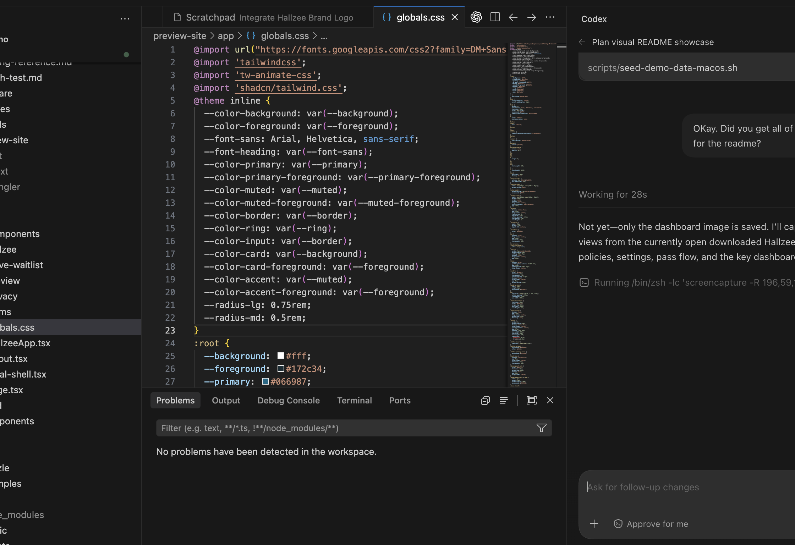
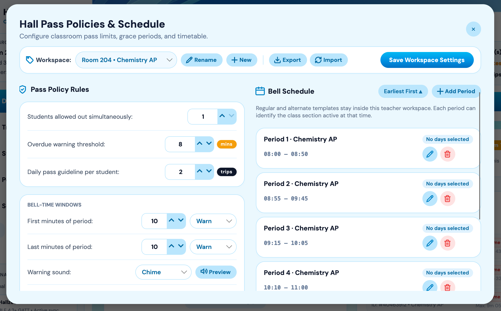
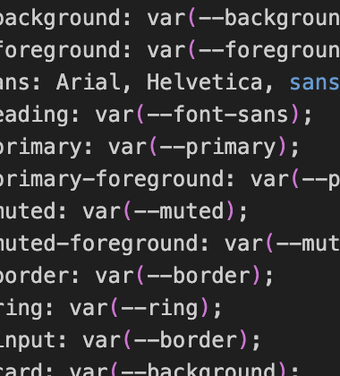
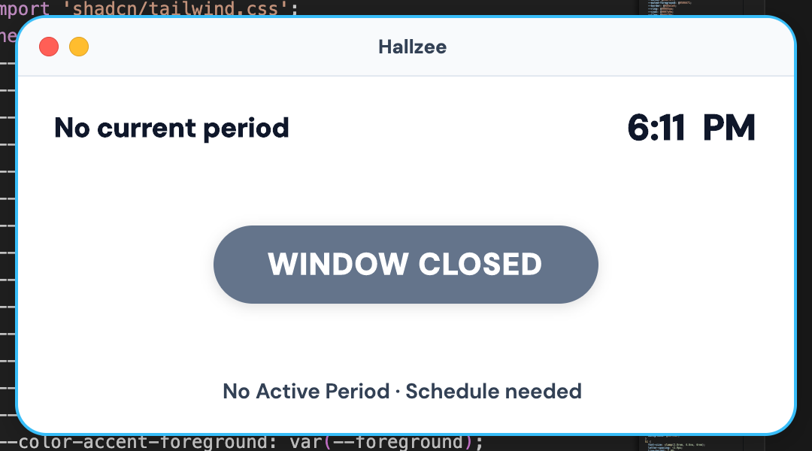

  

<h1 align="center">Hallzee</h1>

  A simple, reliable, and automated hall-pass system for classrooms.

  <a href="docs/getting-started-users.md">Teacher guide</a> ·
  <a href="https://github.com/dannysombrero/hallzee/releases?q=client-v&expanded=true">Downloads</a> ·
  <a href="https://github.com/dannysombrero/hallzee/wiki">Documentation</a> ·
  <a href="CONTRIBUTING.md">Contribute</a> ·
  <a href="LICENSE">License</a>

  
  

Hallzee pairs a keypad terminal with a Windows or Mac app, automating and
streamlining hall passes in your classroom. Students enter their ID when they
leave and return. Teachers can see who is out, review trip history, manage a
roster, and set classroom policies.

**Privacy-centered:** Student names stay on the teacher's computer, and the
terminal continues working if Bluetooth or the internet is unavailable. Only
paired terminals can access a device's trip history.

**Open-source:** Hallzee is free to use, inspect, adapt, and share—there is no
software cost for your classroom.

**DIY-Friendly:** Free 3D-printable models and straightforward setup make it
possible to build a terminal and use Hallzee with minimal technical experience.

  

## Start here

| I want to… | Go to… |
| --- | --- |
| Use Hallzee in my classroom | [Teacher guide](docs/getting-started-users.md) |
| Download the Windows or Mac app | [Desktop downloads](https://github.com/dannysombrero/hallzee/releases?q=client-v&expanded=true) |
| Set up or update a terminal | [Installation and firmware help](https://github.com/dannysombrero/hallzee/wiki/Testing-and-Installation) |
| Fix a problem | [Teacher troubleshooting](docs/getting-started-users.md#when-something-isnt-working) |
| Change the code or hardware | [Developer guide](docs/getting-started-developers.md) |

The current desktop packages are not publisher-signed or notarized, so a
school-managed computer may ask for IT approval when Hallzee is first opened.
The [teacher guide](docs/getting-started-users.md#download-hallzee) explains
what to download and how to open it safely.

## What Hallzee does

- Gives students a quick keypad check-out and check-in flow.
- Shows live pass status in the desktop app, including a compact mini window.
- Saves trips on the terminal during a disconnect and syncs them later.
- Keeps rosters and trip history local to the teacher's computer.
- Supports classroom schedules, pass limits, warnings, reports, and multiple
  class sections.
- Checks for desktop and terminal firmware updates from Hallzee releases.

## Visual tour

### Dashboard

  

### Recent activity, roster, and policy summary

See completed trips at a glance while keeping each class's pass capacity, warning threshold, and daily guideline in view.

  

### Trip history log

Search, filter, export, and review every recorded trip when you need a complete audit trail.

  

### Student roster

Maintain the students assigned to each classroom, including IDs, grades, and class periods, from one place.

  

### Policies and bell times

Set classroom pass limits and warnings alongside the bell schedule that determines when passes are available.

  

### Exceeded-time insights

Quickly spot students with repeated or unusually long trips so you can follow up with the right context.

  

### Mini Pop-up Window

Displays on your smartboard so you and your class can see pass status and whether time windows are open or closed.

  

## Learn more

The [Hallzee Wiki](https://github.com/dannysombrero/hallzee/wiki) is organized
by audience. Teacher instructions come first. Hardware, firmware builds,
architecture, testing, release operations, and design notes live in the
[developer documentation](https://github.com/dannysombrero/hallzee/wiki/Developer-Documentation).

Hallzee is preparing for its first stable release. Maintainers can follow the
[v1.0 release checklist](docs/release-readiness.md); teachers can use the
numbered downloads once they appear on the releases page.

## Contributing

Contributions are welcome. Read [CONTRIBUTING.md](CONTRIBUTING.md) and the
[developer guide](docs/getting-started-developers.md) before opening a pull
request. Please report security problems privately using
[SECURITY.md](SECURITY.md).

## License

Hallzee software and firmware are copyright © 2026 Hallzee Labs and licensed
under [AGPL-3.0-or-later](LICENSE). Hardware and 3D models in
[`models/`](models) use [CC BY-SA 4.0](models/LICENSE). Third-party notices are
listed in [THIRD-PARTY-NOTICES.md](THIRD-PARTY-NOTICES.md).
