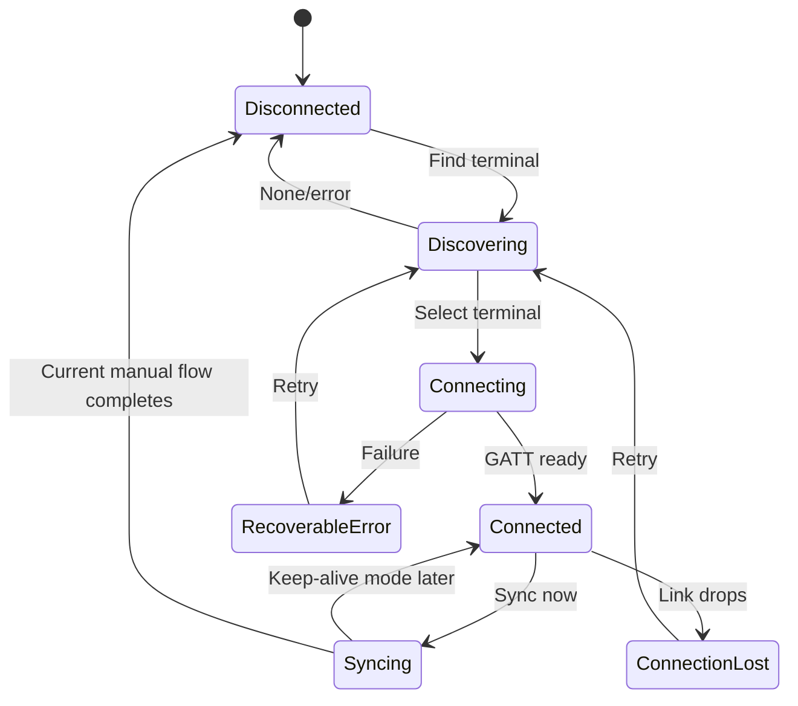

# Hallzee Client UI Architecture and Refactor Specification

**Status:** Planning draft for approval  
**Scope:** Hallzee desktop client UI, uploaded React prototype, and integration boundaries  
**Non-goal:** This document does not authorize product-feature implementation or intentional visual redesign.

## 1. Outcome

Refactor the uploaded 1,107-line React shell into understandable pages, components, hooks, and service adapters while preserving its current appearance and demonstrations. Then connect those presentation contracts to Hallzee's existing C# BLE, SQLite, settings, and export capabilities one feature at a time.

The initial refactor must be behavior-preserving. A feature may move to a different file, but it must not disappear, change meaning, or silently become production behavior.

## 2. Current product surfaces

Hallzee currently has four relevant UI representations:

| Surface | Current role | Production status |
| --- | --- | --- |
| `receiver/windows/Program.cs` | Published .NET 8 WinForms sync client | Current production Windows app |
| `receiver/universal/` | Avalonia desktop client preview using a ViewModel | Candidate future native UI |
| `preview-site/` | Browser-based sync-flow demonstration | Preview only; no Bluetooth hardware |
| Uploaded `bathroom_pass_terminal_client.tsx` | Rich dashboard and future-feature shell | Design/reference prototype |

The uploaded React shell must not become an independent fourth source of business rules. It should consume explicit contracts and mock adapters. The existing C# core remains the reference for implemented sync behavior until a production UI framework decision is approved.

### Current technical debt relevant to the UI work

- The architecture page and its Wiki mirror were corrected in the Phase 0 documentation branch to describe BLE GATT and `TIME_CURSOR`; future implementation work should use those updated versions as its protocol baseline.
- The published WinForms UI still constructs controls and coordinates application behavior in one form class. Its protocol/storage classes are reusable, but the form itself should not become the new dashboard architecture.
- The Avalonia preview already separates a ViewModel from XAML, but it covers only discovery, manual sync, activity, and export—not the new dashboard information architecture.
- The current browser preview and uploaded React shell use different simulated experiences. Consolidate them instead of maintaining both indefinitely.
- The current Open export folder implementation produces a CSV as a side effect, matching open issue #8; the new UI must not preserve that defect as intended behavior.

## 3. Framework decision gate

Before replacing the published WinForms interface, Hallzee must explicitly choose its production presentation host.

### Recommended direction

Use the uploaded React UI as the canonical UX prototype and behavior reference, while keeping BLE, SQLite, protocol parsing, and export logic outside React. Continue treating Avalonia as the leading production-native presentation option because:

- the repository already contains an Avalonia application and ViewModel tests;
- the shared C# core can be reused directly;
- Windows BLE stays in a native adapter;
- no browser application or separate approval path is required;
- the UI can later support macOS without moving device or storage rules into JavaScript.

Under this direction, componentizing the React shell is still useful for design iteration and precise screen contracts, but its hooks are prototype adapters—not the final Bluetooth implementation.

### Alternatives to evaluate before production porting

| Option | Strength | Cost/risk |
| --- | --- | --- |
| Avalonia Views + ViewModels | Reuses current C# architecture and supports a native standalone app | React/Tailwind layout must be translated to XAML/styles |
| React hosted in WebView2 with a .NET bridge | Highest reuse of the uploaded TSX | Windows-only runtime dependency, bridge complexity, harder testing and packaging |
| Electron/Tauri-style desktop host | Direct React reuse | Adds a new runtime and a new native BLE integration path |
| Continue WinForms | Lowest short-term migration cost | Poor fit for the proposed component-rich dashboard |

**Decision required before Phase 3:** Confirm whether Avalonia is the production UI target. The behavior-preserving React refactor can proceed before this decision because it does not alter the released client.

## 4. Architectural principles

1. **Preserve the prototype first.** Refactoring must not intentionally change visuals or interactions.
2. **One source of business truth.** UI components display state and raise intents; they do not parse BLE messages or write SQLite directly.
3. **Local first.** Trips, profiles, rosters, and settings work without cloud services.
4. **Terminal remains authoritative for offline-critical behavior.** Locally recorded trips and terminal-enforced settings must survive an unavailable computer.
5. **Mock and real adapters share contracts.** Demonstration controls remain possible without contaminating production behavior.
6. **Manual trip sync is the current default.** Date/time synchronization remains automatic during the established connection workflow.
7. **Status is structured, not inferred from strings.** Connection and sync states use enums/data objects.
8. **Student data is minimized.** Screens show only information needed for the classroom workflow; diagnostics avoid unnecessary student data.
9. **Refactors and feature changes are separate.** Each pull request should have one primary purpose.

## 5. Current prototype behavior baseline

The following interactions must remain available after componentization:

- Navigate to the dashboard.
- Open the complete history experience from the navigation or recent-trips card.
- Search history by student name, student ID, or trip ID.
- Filter history by all, active, or completed trips.
- Sort supported history fields.
- Trigger the simulated CSV export confirmation.
- Open roster import and simulate a successful roster selection.
- Open terminal discovery, display scanning, list mock terminals, and connect to one.
- Display disconnected, connected, and syncing states.
- Run a simulated manual sync and update the last-sync time.
- Display occupied and available pass states.
- Simulate a student checking out and returning.
- Show the active-trip timer.
- Fall back to student ID when no roster name exists.
- Open terminal settings and preserve the current mocked controls.
- Display toast notifications.
- Use the sandbox controls to exercise demo states.

These are characterization requirements, not a declaration that every action belongs in production. In particular, desktop-driven occupancy simulation and the sandbox must live only in the mock/demo adapter.

## 6. Information architecture

### 6.1 Application pages

| Route/view | Purpose | Initial implementation state |
| --- | --- | --- |
| Dashboard | At-a-glance pass, terminal, sync, and recent-trip state | Prototype exists; refactor first |
| Trips | Complete sortable/filterable trip history and export | Currently a modal; promote to a page |
| Roster | Import status, validation, student mapping, and roster management | Modal shell exists; backend planned |
| Policies | Pass rules, bell schedules, and pause state | Navigation placeholder; planned |
| Terminal | Discovery, selection, connection health, terminal identity, and device settings | Split across dashboard and modals |
| Settings | Profiles and app-level preferences, including future auto-sync controls | Planned |

### 6.2 Modal versus page rule

Use a modal only for a bounded task that can be completed or cancelled without navigation:

- discover/select a terminal;
- confirm a destructive trip action;
- choose and validate a roster file;
- apply a small terminal setting.

Use a page for information that users browse, filter, compare, or revisit:

- full trip history;
- roster management;
- policies and bell schedules;
- terminal management;
- profiles and settings.

The compact recent-trips dashboard remains intentionally small. “View all history” navigates to Trips rather than expanding the dashboard into a dense table.

## 7. Proposed React prototype structure

```text
src/
  app/
    App.tsx
    AppProviders.tsx
    routes.ts
  pages/
    dashboard/DashboardPage.tsx
    trips/TripsPage.tsx
    roster/RosterPage.tsx
    policies/PoliciesPage.tsx
    terminal/TerminalPage.tsx
    settings/SettingsPage.tsx
  components/
    layout/AppShell.tsx
    layout/TitleBar.tsx
    layout/Sidebar.tsx
    feedback/ToastRegion.tsx
    feedback/EmptyState.tsx
    feedback/StatusBadge.tsx
    terminal/TerminalStatusStrip.tsx
    terminal/TerminalDiscoveryDialog.tsx
    terminal/TerminalSettingsDialog.tsx
    pass/PassStatusHero.tsx
    pass/ActiveTripTimer.tsx
    trips/RecentTripsCard.tsx
    trips/TripTable.tsx
    trips/TripFilters.tsx
    roster/RosterSummaryCard.tsx
    roster/RosterImportDialog.tsx
    policies/PolicySummaryCard.tsx
    demo/DemoControls.tsx
  hooks/
    useTerminalConnection.ts
    useTripSync.ts
    useActiveTrip.ts
    useTripQuery.ts
    useRoster.ts
    useTerminalSettings.ts
    useToast.ts
    useDemoScenario.ts
  domain/
    terminal.ts
    trips.ts
    roster.ts
    policies.ts
    profiles.ts
    activity.ts
  services/
    contracts/
      TerminalConnectionService.ts
      TripRepository.ts
      TripSyncService.ts
      ActivePassService.ts
      RosterRepository.ts
      CsvExportService.ts
      ProfileRepository.ts
      TerminalSettingsService.ts
      ActivityEventSink.ts
    mock/
      MockTerminalConnectionService.ts
      InMemoryTripRepository.ts
      MockTripSyncService.ts
      MockRosterRepository.ts
      MockTerminalSettingsService.ts
  test/
    fixtures/
    scenarios/
```

The exact framework router can be chosen during implementation. The route model must remain simple enough to map to Avalonia navigation/ViewModels later.

## 8. State ownership

### 8.1 Application state

| State | Owner | Persistence |
| --- | --- | --- |
| Current route | App/router | Session only |
| Active profile ID | Profile service | Local settings database |
| Toast queue | Toast provider | None |
| Demo mode/scenario | Demo provider | Session only; absent from production |

### 8.2 Terminal state

| State | Owner | Notes |
| --- | --- | --- |
| Discovery results | Connection service | Cleared/replaced per discovery run |
| Selected terminal | Connection service/profile association | Remembered per profile when implemented |
| Connection state | Connection service/state machine | Never inferred from label text |
| Sync state/progress | Sync orchestrator | Exclusive operation; no overlapping sync/settings writes |
| Last successful sync | Sync service/repository | Persist successful completion time |
| Live active-pass state | Active-pass service | Not available from `TIME_CURSOR`; requires a planned terminal query/event |
| Maximum student-ID length | Terminal settings service | Terminal is authoritative |
| Terminal name | Terminal settings service | Planned; terminal is authoritative |

### 8.3 Classroom data

| Data | Owner | Authority |
| --- | --- | --- |
| Trip records | SQLite repository | Terminal is origin; client is durable local copy |
| Active trip displayed by client | Active-pass query/event when implemented | Demo-only until the terminal can explicitly report occupied/available state and checkout time |
| Roster | Local roster repository | Active profile |
| Name/class/period enrichment | Query layer | Derived by joining trips with roster |
| Policies and bell schedule | Profile repository | Client configuration; offline enforcement decision pending |
| Auto-sync preferences | Profile repository | Client-only; default off |

## 9. Domain models

Use typed models instead of free-form strings.

```ts
type ConnectionState =
  | 'disconnected'
  | 'discovering'
  | 'connecting'
  | 'connected'
  | 'syncing'
  | 'connectionLost'
  | 'recoverableError';

type TripStatus = 'active' | 'completed' | 'manualReset';

interface Trip {
  id: number;
  studentId: string;
  checkedOutAt: Date;
  checkedInAt?: Date;
  durationSeconds?: number;
  status: TripStatus;
}

interface EnrichedTrip extends Trip {
  studentName?: string;
  className?: string;
  period?: string;
}

interface TerminalSummary {
  stableId: string;
  advertisedName: string;
  configuredName?: string;
  signalStrength?: number;
}
```

Formatting such as `Today, 9:22 AM`, `6m 20s`, `#9042`, and badge text belongs in presentation helpers, not stored domain data.

## 10. Hook responsibilities

Hooks coordinate UI-facing state; they do not contain protocol parsing or persistence code.

| Hook | Responsibility | Must not do |
| --- | --- | --- |
| `useTerminalConnection` | Discover, select, connect, disconnect, expose state | Parse trip payloads or write SQLite |
| `useTripSync` | Start manual sync, expose progress/result, serialize operations | Implement BLE transport |
| `useActiveTrip` | Present active/available/unknown state and elapsed display time | Create production trips from desktop simulation |
| `useTripQuery` | Search, filter, sort, page, and summarize repository results | Maintain a second copy of trip truth |
| `useRoster` | Import intent, validation results, active roster metadata | Parse CSV directly in components |
| `useTerminalSettings` | Query/apply settings and expose errors | Assume a local draft was accepted by the kiosk |
| `useToast` | Queue accessible transient messages | Replace persistent error/status UI |
| `useDemoScenario` | Drive current simulated interactions | Be included in production composition root |

## 11. Service contracts and existing implementation mapping

| Contract | Existing code to adapt | Current readiness |
| --- | --- | --- |
| Terminal connection | `BluetoothConnectionManager.cs`; `TerminalConnectionPort.cs` | Implemented on Windows |
| Sync session | `SyncSession.cs` | Implemented and tested |
| Active-pass state | No production protocol command/event exists | Planned; required before a live occupied/available dashboard |
| Trip persistence/query | `TripSqliteRepository.cs` | Persistence implemented; UI query API needs expansion |
| Terminal settings | `KioskSettingsProtocol.cs` plus WinForms flow | Maximum ID length implemented |
| CSV export | `TripSqliteRepository.ExportCsv` and WinForms actions | Implemented with open issues #7 and #8 |
| Activity events | Currently logs/string updates | Needs structured translation; issue #9 |
| Roster storage/import | None in production core | Planned; issue #17 |
| Profiles/settings | None in production core | Planned; issue #19 |
| Policy/schedule engine | None | Planned; issues #20 and #21 |
| Auto-sync orchestrator | Manual cursor sync exists | Planned and disabled; issue #23 |

### Contract rule

Every contract must have:

1. a mock implementation for deterministic prototype behavior;
2. a native implementation or adapter for production;
3. tests that both implementations obey the same externally visible outcomes where applicable.

## 12. Feature-to-UI mapping

| UI concept in uploaded shell | Product status | Planned connection |
| --- | --- | --- |
| Find Terminal dialog | Real feature | Windows BLE discovery; issues #5, #10, #11 |
| Connected/disconnected/syncing badges | Real feature, presentation incomplete | Structured connection state |
| Sync Now | Real feature | Existing cursor-based `TIME_CURSOR` sync |
| Automatic clock alignment | Real feature | Existing connection/sync command flow |
| Last successful sync | Partially represented | Persist on successful sync completion |
| Live occupied/available state and timer | Demo only today | Requires an active-pass query/event; `TIME_CURSOR` exposes completed/reset records only |
| Recent trips | Planned UI | SQLite query; issue #18 |
| Full trip history | Planned UI | SQLite query/filter/sort; issue #18 |
| Export CSV | Real feature | Existing export service; issue #7 |
| Open export folder | Real feature needing correction | Open-only behavior; issue #8 |
| Student name fallback | Prototype behavior | Roster join with safe ID fallback |
| Roster CSV import | Planned | Issue #17 |
| Maximum student-ID length | Real terminal setting | Implemented 4–16 range; terminal authoritative |
| Terminal assigned name | Planned | Issue #22 |
| Auto-sync on connection | Planned, default off | Issue #23 |
| Auto-sync new transactions while connected | Planned, default off | Issue #23 |
| Pass capacity | Planned | Issue #20; enforcement location unresolved |
| Overdue warning | Prototype-only proposal | Must be approved before implementation |
| Daily max per student | Prototype-only proposal | Must be approved before implementation |
| Bell times | Planned | Issue #20 |
| Pause rules | Planned | Issue #21 |
| Classroom profile | Planned | Issue #19 |
| Desktop Check In / Simulate Tap | Demo only | `useDemoScenario`; never production command |
| Sandbox toolbar | Demo only | Development/preview composition only |

## 13. Connection and operation state model

### Connection states



For the current manual workflow, completion may intentionally disconnect. Future continuous auto-sync will keep `Connected` distinct from `Syncing` and must not be represented as already implemented.

### Exclusive terminal operations

Only one of these may use the terminal command channel at a time:

- time/cursor sync;
- full-history recovery;
- settings query/update;
- terminal rename;
- future policy transfer.

An operation coordinator queues or rejects a second request with a clear UI message. Components must not disable unrelated navigation merely because a terminal operation is active.

### Active-pass state gap

The current terminal persists an in-progress checkout in Preferences, but it does not expose that checkout through `TIME_CURSOR`. A numbered, syncable trip is created only after check-in or manual reset. Therefore a production client cannot currently infer whether the pass is occupied, which student is out, or when the active checkout began—even while BLE is connected.

Until an explicit protocol feature is implemented:

- occupied/available status and the running timer remain part of the demo adapter only;
- the production dashboard must show active-pass state as unavailable/unknown rather than infer it from completed trip history;
- a connected badge must not imply that active-pass information is live.

The future feature should define a versioned query and/or event such as an active-pass snapshot with `NONE` or the active student ID and checkout timestamp. Exact command names and payloads require a focused protocol design, fragmentation tests, reconnect behavior, and student-data review before implementation.

## 14. Privacy and safety boundaries

- Store trip and roster information locally by default.
- Do not send roster names, class names, or periods to the terminal for roster enrichment.
- Use student IDs only where operationally necessary.
- Default dashboard history to a compact recent subset.
- Avoid names and IDs in low-level diagnostic logs unless a specific troubleshooting mode is enabled.
- Require confirmation and audit metadata before future trip editing/deletion.
- Do not expose admin/dean access until authentication, permissions, and shared storage are explicitly designed.

## 15. Behavior-preservation test plan

### 15.1 Characterization tests before moving code

Capture current outcomes with component/integration tests:

1. Dashboard renders connected, occupied, recent-trip, roster, and policy summaries.
2. Disconnected state replaces sync actions with terminal discovery guidance.
3. Find Terminal enters scanning state and renders the discovered device list.
4. Selecting a device completes the mock connection and updates terminal identity.
5. Sync Now enters syncing state, returns to connected, updates last-sync text, and emits a toast.
6. Active timer increments only in the current connected/occupied demo scenario.
7. Demo checkout/check-in transitions update recent trips exactly once.
8. History search, status filters, and sort directions preserve current outcomes.
9. Missing roster names use the student-ID fallback.
10. Roster import updates the displayed filename and closes its dialog.
11. Settings dialog retains the current fields and planned-feature marker.
12. Escape/close buttons and focus behavior work for every dialog.

### 15.2 Refactor verification

- Use fixture data equivalent to `INITIAL_TRIPS` and `DISCOVERABLE_TERMINALS`.
- Prefer roles and accessible names over CSS selectors.
- Add visual snapshots only for major page-level regressions; interaction tests remain authoritative.
- Do not update snapshots merely to make a refactor pass without reviewing the difference.
- Run the original and refactored shell against the same scenario fixtures during the migration window.

### 15.3 Native integration verification

| Capability | macOS sufficient? | Windows required? |
| --- | --- | --- |
| React component behavior and mock services | Yes | No |
| Shared C# ViewModel/core tests | Yes where .NET target permits | No for core-only tests |
| SQLite queries/export formatting | Yes | No |
| Windows BLE discovery/GATT connection/reconnect | No | Yes |
| Physical ESP32 sync/settings update | No | Yes, with physical Hallzee |
| Final packaged Windows layout and accessibility | No | Yes |

Windows behavior must be reported as unverified until tested on a Windows PC. UI-only preview checks must not be described as Bluetooth validation.

## 16. Phased implementation roadmap

### Phase 0 — Approve architecture

- Approve this document.
- Decide where the uploaded React prototype lives in the repository.
- Keep the published client unchanged.
- Record the production UI framework decision as pending or choose Avalonia.

### Phase 1 — Characterize and componentize the React shell

- Add tests around current prototype behavior.
- Extract domain types and fixture data.
- Extract AppShell, title bar, sidebar, toast region, dashboard widgets, dialogs, and trip table.
- Introduce page-level components without changing styling.
- Move all simulations into mock services and `useDemoScenario`.
- Preserve every baseline interaction listed in Section 5.

**PR boundary:** No real BLE, SQLite, firmware, or new product features.

### Phase 2 — Establish UI-facing application contracts

- Define service interfaces and operation/result models.
- Define the `ActivePassService` contract and explicit unavailable/unknown state without inventing production data.
- Add structured connection and activity events.
- Expand repository query interfaces for recent trips and full history.
- Add mock contract tests.
- Adapt existing C# core to parallel ViewModel/application contracts.

**PR boundary:** Architecture and adapters; minimal intentional UI change.

### Phase 3 — Confirm and build production presentation host

- Confirm Avalonia or another approved host.
- Reproduce AppShell, navigation, Dashboard, and Terminal status using production ViewModels.
- Bind Find Terminal and Sync Now to existing native services.
- Keep WinForms available until replacement acceptance criteria pass.

### Phase 4 — Pair implemented backend features

Order:

1. BLE discovery, selected terminal, connection states, and manual incremental sync.
2. Active-pass query/event protocol and live occupied/available state.
3. Maximum student-ID length query/apply.
4. SQLite recent trips and full history.
5. CSV save and open-folder corrections.
6. Human-readable activity events.

Each feature gets mock tests, core tests, native ViewModel tests, and the required Windows hardware check.

### Phase 5 — Add planned data foundations

Order:

1. Database migrations.
2. Local profiles/settings.
3. Roster CSV import, validation, and ID enrichment.
4. Known-terminal association per profile.
5. Trip query summaries and pagination.

### Phase 6 — Add policy and automation features

- Terminal naming.
- Pass-policy and bell-schedule engine.
- Pause/resume policy behavior.
- Auto-sync on connection.
- Auto-sync new transactions while actively connected.

These require individual feature designs before implementation.

## 17. Pull-request rules

1. Do not combine componentization with a backend feature.
2. Do not intentionally restyle during behavior-preserving refactors.
3. Keep demo-only controls visibly and structurally separate from production composition.
4. Update relevant `docs/` and matching Wiki sources when a change affects operation, testing, setup, or platform support.
5. State whether Mac testing is sufficient and exactly which Windows behavior remains unverified.
6. Keep current WinForms publishing intact until the replacement client is explicitly approved.
7. Never migrate/delete teacher data as part of a UI refactor.

## 18. Decisions still requiring approval

| Decision | Recommendation | Needed by |
| --- | --- | --- |
| Production UI framework | Avalonia, with React as UX prototype | Before Phase 3 |
| React prototype repository location | Replace/expand `preview-site` rather than create another top-level client | Before Phase 1 |
| Full history presentation | Dedicated Trips page; dashboard stays compact | Approved direction, formalize in Phase 1 |
| Desktop-driven check-in/out | Demo only | Before production Dashboard port |
| Active trip freshness | Demo-only until an explicit active-pass query/event exists; later show live only from that source and label unavailable/stale states | Before real dashboard binding |
| Policy enforcement location | Offline-essential limits should be terminal-enforced; client configures | Before policy feature design |
| Continuous Bluetooth connection | Only when future live auto-sync is enabled | Before issue #23 implementation |
| Trip edit/delete behavior | Require audit trail and clear terminal/client ownership | Before issue #15 design |

## 19. Definition of done for the first refactor

The first componentization is complete when:

- no primary page or reusable dialog remains embedded in `App.tsx`;
- `App.tsx` is primarily composition, providers, and routing;
- demo behavior uses injected mock services;
- all interactions in Section 5 still work;
- characterization tests pass;
- no released client or firmware behavior changes;
- no planned feature is presented as implemented;
- the original uploaded file remains recoverable through version control or an archived reference during review;
- the resulting structure can be mapped clearly to native Views/ViewModels.

## 20. Immediate next action after approval

After this documentation PR merges, create a fresh Phase 1 branch from updated `main`. First add characterization tests for the existing React shell, then move it into `preview-site` and componentize it behind mock services without intentional visual or behavioral changes. Do not add real BLE, SQLite, firmware, active-pass, or other product features in that refactor PR.
