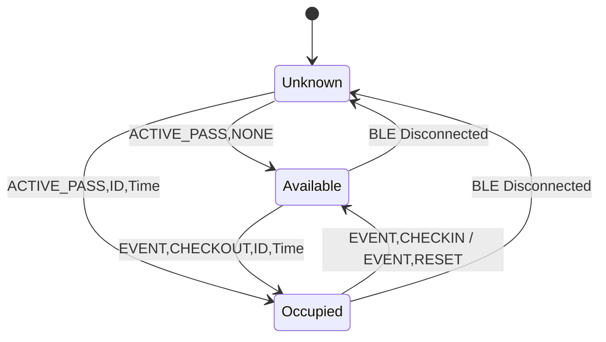

# Feature Design: Live Active-Pass Protocol & Real-Time Tracking

**Status:** Implemented

**Target Milestone:** Delivered

**Related Issues:** #13, #14  
**Scope:** Closing the active-pass gap between ESP32 Preferences and Desktop UI via BLE query & event notifications.

---

## 1. Problem Statement & Background

The ESP32 terminal persists in-progress checkouts in Non-Volatile Storage (`Preferences`), while the standard `TIME_CURSOR` sync command transfers only finalized (completed or manually reset) records from LittleFS flash.

The desktop therefore uses the explicit real-time query and notifications below rather than inferring occupancy from completed trip history.

This feature adds an explicit `GET_ACTIVE_PASS` query command and asynchronous live event notifications over the existing BLE GATT channel.

---

## 2. Protocol Specification

### 2.1 Polling / Query Command (`GET_ACTIVE_PASS`)

Sent by the desktop client immediately after the `HELLO,1` / `SETTINGS` handshake.

**Command:**
```text
GET_ACTIVE_PASS\n
```

**Responses from Terminal:**
- When a pass is currently checked out:
  ```text
  ACTIVE_PASS,<student_id>,<epoch_timestamp_seconds>\n
  ```
  *(Example: `ACTIVE_PASS,10482,1725204120`)*
- When the pass is available:
  ```text
  ACTIVE_PASS,NONE\n
  ```

---

### 2.2 Asynchronous Event Notifications (When Connected)

When the desktop client maintains an active BLE connection with the terminal, the terminal emits live notifications on the TX characteristic whenever a pass changes state:

1. **Student Checks Out:**
   ```text
   EVENT,CHECKOUT,<student_id>,<epoch_timestamp_seconds>\n
   ```
2. **Student Checks In (Normal Completion):**
   ```text
   EVENT,CHECKIN,<student_id>,<duration_seconds>\n
   ```
3. **Teacher Manual Reset (`* + #`):**
   ```text
   EVENT,RESET,<student_id>,<duration_seconds>\n
   ```
4. **Teacher Manual Check In (desktop):** the desktop sends `MANUAL_CHECKIN`; the terminal records the trip as `MANUAL`, then sends the same `EVENT,CHECKIN` and `LIVE_TRIP` notifications as a kiosk check-in.

---

## 3. Desktop Client State Machine & Timer Sync



### Timer Mechanics
1. Upon receiving `ACTIVE_PASS,<student_id>,<checkout_time>`, the client calculates initial elapsed time:
   $$\text{elapsedSeconds} = \text{CurrentSystemEpochSeconds} - \text{checkout\_time}$$
2. The client runs a local 1-second UI timer incrementing `elapsedSeconds` without polling the hardware repeatedly.
3. If the link disconnects, the UI displays `Disconnected (Pass status unknown)` rather than guessing occupancy from historical records.

---

## 4. Implementation

### `BluetoothSync.cpp`
- `BluetoothSync` implements `GET_ACTIVE_PASS`, active-pass events, and
  `MANUAL_CHECKIN`.
- The terminal and desktop also implement `GET_ACTIVE_PASSES` and
  `SET,MAX_ACTIVE_PASSES,<1-8>` for multi-pass classrooms. `GET_ACTIVE_PASS`
  remains compatible by returning the oldest active checkout.
- The Universal desktop client calculates elapsed time locally, enriches the
  active student from the local roster, and returns to an unknown state on
  disconnect.

The original single-pass handler is retained here as protocol pseudocode:
  ```cpp
  if (strcmp(cmd, "GET_ACTIVE_PASS") == 0) {
      if (terminalController.hasActivePass()) {
          char response[64];
          snprintf(response, sizeof(response), "ACTIVE_PASS,%s,%lu\n",
                   terminalController.getActiveStudentId(),
                   terminalController.getActiveCheckoutTime());
          sendNotification(response);
      } else {
          sendNotification("ACTIVE_PASS,NONE\n");
      }
  }
  ```
- Trigger `sendNotification()` inside `TerminalController` event callbacks when notifications are enabled.

---

## 5. Verification & Testing Matrix

## Remaining enhancement: teacher-initiated checkout

The kiosk now persists up to eight active passes, exposes the capacity setting,
and reports the oldest active pass to the primary dashboard. Desktop manual
check-in records `MANUAL`. Teacher-initiated checkout is intentionally not yet
implemented; it requires a separate authorization and classroom-policy design.

| Capability | macOS Testing | Windows Testing | Hardware Required |
| :--- | :--- | :--- | :--- |
| Active-pass domain models & timer ViewModel tests | **Sufficient** | Optional | No |
| BLE mock session & packet framing tests | **Sufficient** | Optional | No |
| WinRT BLE GATT active-pass notifications | **Not Usable** | **Required** | **Yes (BLE PC)** |
| Physical ESP32 Preferences query & keypad event stream | **Not Usable** | **Required** | **Yes (ESP32 Kiosk)** |
