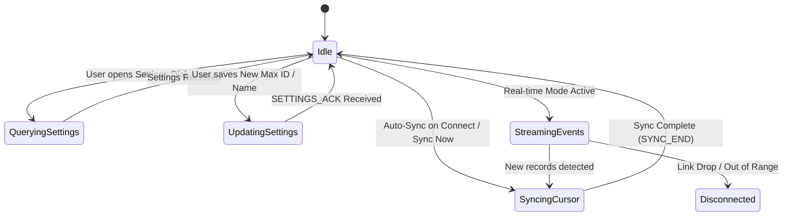

# Feature Design: Background Auto-Sync & Connection Orchestration

**Status:** Partially implemented; orchestration and preferences remain planned

**Target Milestone:** Phase 6 (Add Policy & Automation Features)  
**Related Issues:** #23  
**Scope:** Automated BLE connection management, background sync triggers, channel arbitration, and non-blocking desktop UX.

---

## 1. Problem Statement & User Behavior

### Current implementation

The Universal client already performs an incremental sync after an explicit
connection, receives `EVENT`/`LIVE_TRIP` notifications while the connection is
open, and automatically retries the last authenticated terminal for up to 45
seconds after startup or an unexpected disconnect. This is reconnect and live
streaming support, not the full configurable auto-sync feature described below.

The remaining work is a persisted teacher preference surface, discovery-driven
connection when enabled, and one operation coordinator that serializes sync,
settings, recovery, and policy-transfer writes. Until that coordinator exists,
the client must not advertise automatic/background synchronization as a fully
delivered feature.

In the initial release, syncing completed trip logs requires the teacher to manually click **Sync Now** on the desktop interface. While this provides explicit control, teachers in active classrooms benefit from an autonomous background synchronization model:

1. **Auto-Sync on Connect:** When the teacher brings their laptop into the classroom (or turns on the kiosk), the desktop client detects the kiosk's BLE advertisement, connects, aligns the clock, and automatically streams new trips.
2. **Continuous Transaction Streaming:** While actively connected, any new checkout, checkin, or reset immediately streams across BLE to the desktop without manual intervention.
3. **Seamless Manual Overrides:** Teachers can still click **Sync Now** or open **Terminal Settings** without race conditions or communication collisions.

---

## 2. Synchronization Coordinator & Channel Arbitration

Because the BLE characteristic writes and notifications share a single virtual serial pipe, operations must be strictly serialized by an `IOperationCoordinator`:

### Queue Priority Rules
1. **High Priority (User Initiated):** Settings Updates (`SET,MAX_ID_LENGTH`), Terminal Rename, Manual Full Recovery (`SYNC_ALL`).
2. **Normal Priority (Automatic):** Startup `HELLO,1` Handshake, `GET_SETTINGS`, `TIME_CURSOR` Incremental Sync, `GET_ACTIVE_PASS`.
3. **Background Stream (Passive):** Asynchronous `EVENT,CHECKOUT` and `EVENT,CHECKIN` notifications.

If a High Priority command is initiated while a background cursor sync is streaming, the coordinator waits for the current in-flight record `ACK` to settle before issuing the high-priority write.

---

## 3. Reconnect Strategy & Radio Hygiene

- **Remembered-device fast path:** After a terminal has been claimed, the
  desktop client restores its saved transport and attempts a direct reconnect
  immediately when the app starts or the link drops. This does not show the
  date/time or physical pairing flow again.
- **Discovery fallback:** If the saved BLE address is no longer usable, the
  client scans for the matching terminal identity and updates the saved
  transport after a successful reconnect.
- **Bounded retry window:** The first attempt is immediate. The client shows a
  seconds-remaining countdown while retrying for up to 45 seconds, then returns to
  manual recovery instead of retrying forever.
- **Session Cleanup:** On connection loss, the desktop clears in-memory stream buffers while leaving durable SQLite records intact. The kiosk resumes standard BLE advertising within 500ms.

---

## 4. Configuration & User Preferences

When implemented, auto-sync behavior will be configurable in **Settings >
Connection Preferences**:
- `Auto-sync on connection` (Default: **Disabled**)
- `Keep continuous live connection` (Default: **Disabled**)
- `Sync interval when connected` (Default: **Real-time event driven**)

---

## 5. Verification & Testing Matrix

| Capability | macOS Testing | Windows Testing | Hardware Required |
| :--- | :--- | :--- | :--- |
| Channel arbitration queue & concurrency unit tests | **Sufficient** | Optional | No |
| Backoff timer and state machine tests | **Sufficient** | Optional | No |
| Reconnect resilience and SQLite deduplication tests | **Sufficient** | Optional | No |
| WinRT background BLE advertisement watcher | **Not Usable** | **Required** | **Yes (BLE PC)** |
| Physical kiosk long-term connection stability (8 hours) | **Not Usable** | **Required** | **Yes (ESP32 Kiosk)** |
