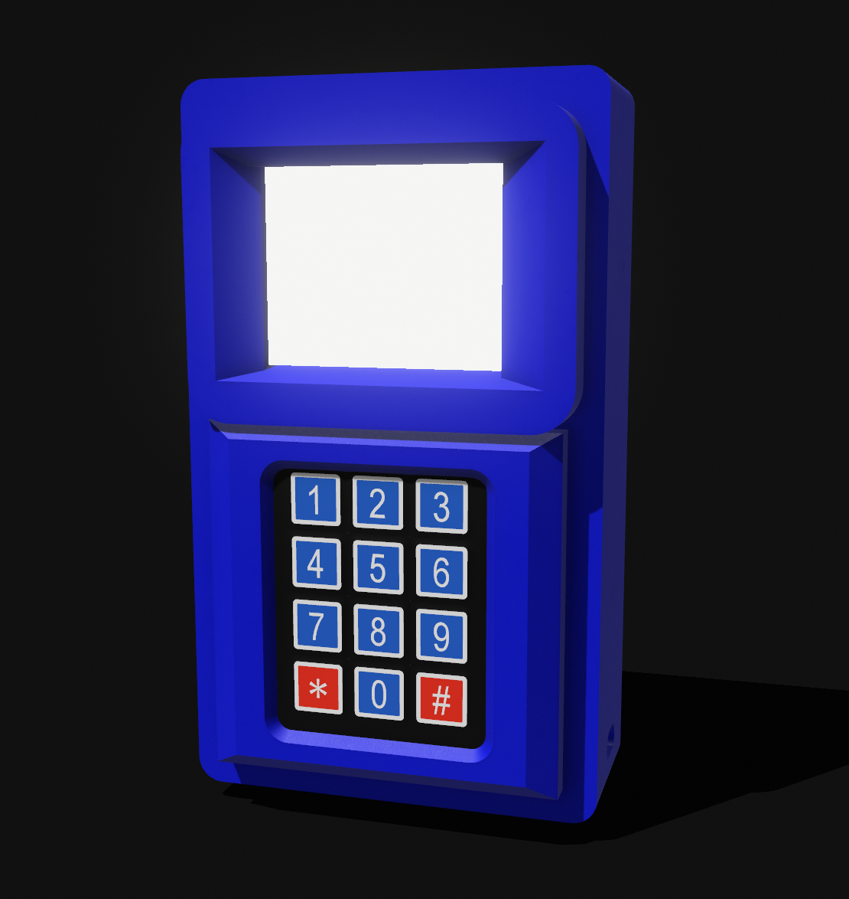
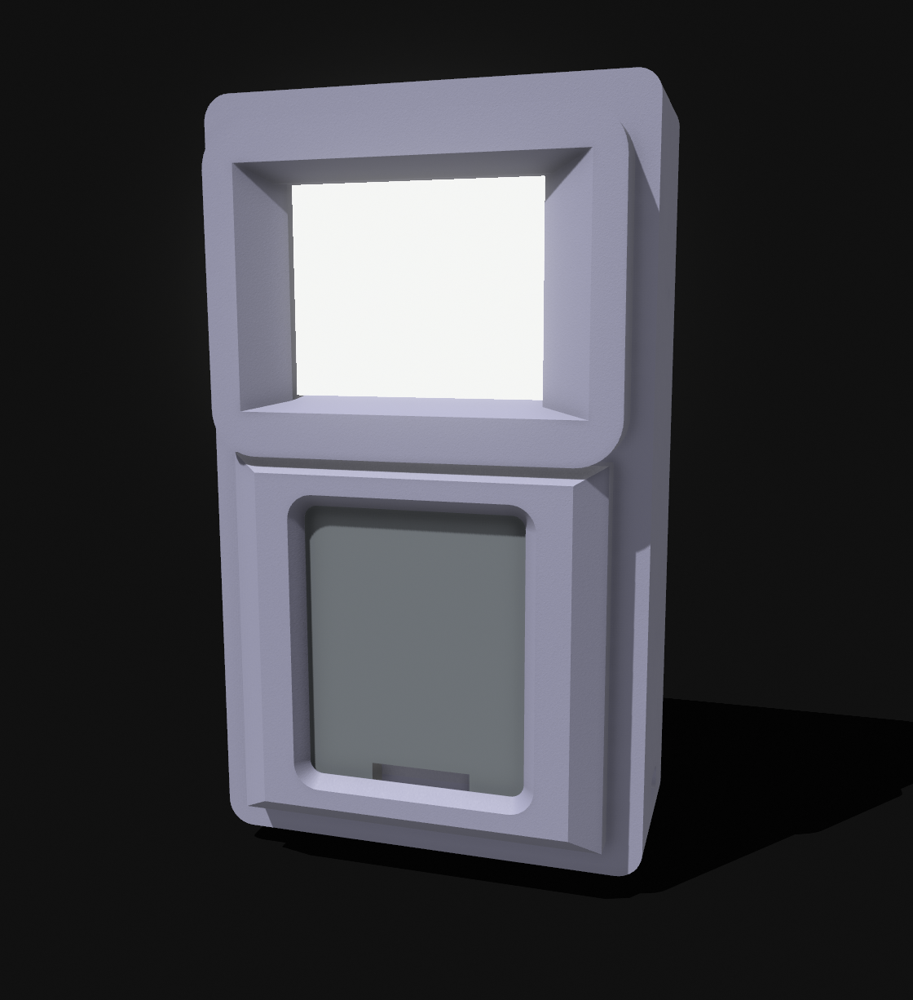
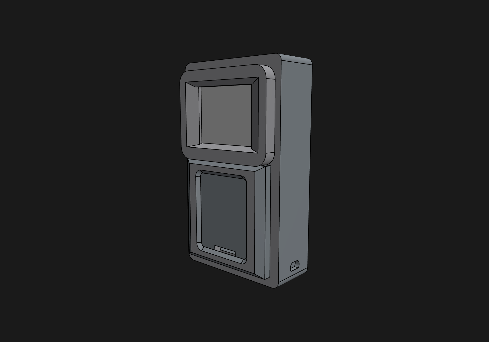

# Hallzee 3D models

This directory contains the production and historical 3D models, fabrication assets, and renders for the Hallzee terminal enclosures.

## 2.8″ Terminal 3D Renders

### Assembled Terminal
Fully assembled Hallzee 2.8″ terminal enclosure with 3×4 membrane keypad and ILI9341 display:

  

### Enclosure Shell
Modular front cover and main body printed in PLA:

  

### CAD Assembly and Port Geometry
CAD model view displaying the enclosure contours, internal component fit, and side micro-USB cable cutout:

  

## Production Files (2.8″ Terminal)

- **`Hallzee_Terminal_2.8''_Main_Case_v1.3mf`**: Main enclosure body housing the ESP32 DevKit V1 and display mounting posts.
- **`Hallzee_Terminal_2.8''_Back_v1.3mf`**: Rear enclosure plate with mounting holes.
- **`Hallzee_Terminal_2.8''_LCD_and_Keypad_Cover_v1.3mf`**: Front bezel securing the 2.8″ TFT and 3×4 membrane keypad.
- **`Hallzee_Terminal_2.8''_Keypad_BackSupport_V1.3mf`**: Internal bracket providing rigid backing behind the membrane keypad.
- **`Hallzee_Terminal_2.8''_ESP32_Stabilizer.3mf`**: Internal stabilizer clip locking the ESP32 board in position.
- **`Hallzee_Case_Whole_v1.step`**: Full assembly STEP file for customization in CAD software (Fusion 360, FreeCAD, Onshape, etc.).

## Guides and Licensing

- [Build Your Own Terminal Guide](../docs/build-your-own-terminal.md): Step-by-step assembly, bill of materials, no-solder wiring, and flashing instructions.
- [Wiki 3D Models Guide](https://github.com/dannysombrero/hallzee/wiki/3D-Models): Complete documentation in the project wiki.
- **License**: All 3D models and fabrication assets in this directory are licensed under [Creative Commons Attribution-ShareAlike 4.0 International (CC BY-SA 4.0)](LICENSE).
