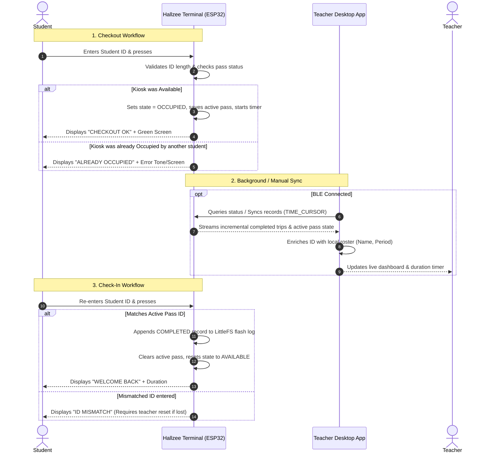

# Hallzee Product and Requirements Document (PRD)

**Status:** Approved Reference  
**Scope:** Hallzee Kiosk Hardware, Desktop Application, Classroom Workflows, Data Management, and Cloud Boundaries  
**Target Version:** v1.x (Local-First Native Client & Kiosk)

---

## 1. Executive Summary & Vision

Hallzee is an open-source, local-first classroom hall pass and bathroom sign-in system designed specifically for school environments. Traditional hall pass systems either rely on cumbersome paper sign-out sheets that lack accountability or expensive cloud-only SaaS platforms that require student accounts, track student locations invasively, and fail whenever school Wi-Fi degrades.

Hallzee provides a dedicated physical hardware terminal (ESP32-based kiosk with keypad and color display) placed by the classroom door, paired via Bluetooth Low Energy (BLE) with a teacher's desktop workstation. 

### Core Product Tenets
1. **Zero Student Account Friction:** Students sign out and in using existing numeric student IDs on a physical keypad. No logins, phones, or RFID tags are required.
2. **Local-First & Offline Autonomy:** The kiosk operates autonomously without needing an active computer connection or Wi-Fi. The desktop client stores all history in a local SQLite database on the teacher's machine.
3. **Student Privacy by Design (FERPA Compliance):** Student names, class rosters, and schedules are stored strictly on the local desktop and are never transmitted to or stored on the physical kiosk terminal.
4. **Non-Intrusive Teacher Oversight:** Teachers gain immediate, at-a-glance awareness of who is out of the room, trip duration, capacity limits, and historical patterns without interrupting instruction.

---

## 2. Intended Users & Classroom Workflows

### 2.1 User Personas

| Persona | Role & Objectives | Key Interactions |
| :--- | :--- | :--- |
| **Classroom Teacher** | Primary user; manages passes, monitors classroom occupancy, analyzes attendance patterns. | Monitors desktop dashboard, syncs trip logs over BLE, manages class rosters, configures pass policies, exports CSV logs. |
| **Student** | Primary physical actor; signs out and in at the door kiosk. | Types student ID on keypad, presses `#` (Enter) to check out, presses `#` again upon return to check in. |
| **Hall Monitor / Dean** | Secondary stakeholder; verifies students in hallways. | Checks student ID against hall pass time windows or reviews exported teacher logs during investigations. |
| **School IT / Administrator** | Deployment & compliance; ensures student data privacy and device reliability. | Sets up kiosk hardware, configures desktop application, verifies local data boundaries. |

---

### 2.2 Core Classroom Workflows

### 2.3 Edge Case & Recovery Workflows
- **Forgot to Check In / Stuck Active Pass:** If a student leaves or forgets to check in, the teacher (or student with permission) holds `* + #` on the kiosk keypad for 2 seconds to trigger an administrative manual reset. The terminal appends a `MANUAL_RESET` record to the flash log and returns the terminal to available.
- **Kiosk Disconnected from PC:** The terminal continues normal operations, logging up to hundreds of trips in LittleFS flash storage. When the PC reconnects, all buffered trips are incrementally synchronized without data loss.

---

## 3. Product Functional Requirements

### 3.1 Live Dashboard & Active Pass Monitoring
- **FR-DASH-1:** The desktop application must display the real-time status of the primary classroom terminal (Disconnected, Discovering, Connecting, Connected, Syncing, Error).
- **FR-DASH-2:** When a terminal is connected, the dashboard must show whether the bathroom/hall pass is currently `AVAILABLE` or `OCCUPIED`.
- **FR-DASH-3:** If occupied, the dashboard must display:
  - Enriched student name (resolved from local roster) or fallback student ID.
  - Formatted departure time (e.g., `9:42 AM`).
  - Live elapsed duration timer (e.g., `4m 12s`) with visual warning cues if a duration threshold is exceeded.
- **FR-DASH-4:** The dashboard must present a compact summary of recent trips (last 5–10 records) with quick navigation to full history.

### 3.2 Trip History & CSV Export
- **FR-HIST-1:** The client must store a permanent, append-only historical record of all completed trips in a local SQLite database.
- **FR-HIST-2:** The history view must provide real-time search across student ID, student name, and date.
- **FR-HIST-3:** Filtering must support status (`All`, `Completed`, `Manual Reset`) and date ranges (Today, This Week, Custom).
- **FR-HIST-4:** One-click CSV export must produce a cleanly formatted CSV file containing standard headers (`trip_id,student_id,student_name,class_period,trip_date,time_out,time_in,duration_seconds,status`).
- **FR-HIST-5:** The desktop client must provide an "Open Export Folder" action that opens the local directory without creating extraneous files.

### 3.3 Student Roster & ID Enrichment
- **FR-ROST-1:** Teachers must be able to import class rosters from standard CSV or Excel exports generated by Student Information Systems (SIS) such as PowerSchool, Canvas, or Google Classroom.
- **FR-ROST-2:** Roster import must support flexible column mapping (Student ID, First Name, Last Name / Full Name, Class Period, Grade).
- **FR-ROST-3:** If a student ID recorded by the kiosk is not found in the active roster, the UI must safely fall back to displaying the raw Student ID without crashing or dropping the record.
- **FR-ROST-4:** Rosters must belong to a teacher workspace. One workspace may contain multiple named class sections/period rosters without creating a separate teacher profile for each class.

### 3.4 Teacher Workspaces, Policies & Bell Schedules
- **FR-POL-1:** A profile represents a teacher workspace, normally one per teacher/room rather than one per class period. A teacher workspace may contain multiple class sections and schedules.
- **FR-POL-2:** Teachers must be able to configure pass policies per teacher workspace, with optional schedule/class-section context where needed:
  - Maximum simultaneous passes allowed (default: 1).
  - Maximum duration warning threshold (e.g., 7 minutes).
  - Daily/weekly pass limit per student (e.g., max 2 passes per day).
  - "10/10 Rule" or lockout windows (no passes permitted during first/last 10 minutes of class).
- **FR-POL-3:** Teachers must be able to define bell schedules (period start and end times) to select the active class-section context and apply relevant policy guidance. Bell times do not switch teacher profiles.
- **Bell-time policies:** Policies/Bell Times supports named schedule templates, weekday assignments, date-specific exceptions, and distinct schedules for Wednesdays, block days, assemblies, and early-release days. Teachers choose whether the first and last configurable minutes allow passes, show a visual warning, or lock new checkouts. Terminal enforcement is optional and disabled by default; when enabled, the terminal receives a resolved 14-day offline copy. Trips export the matched schedule and class section when available. Alert sounds remain desktop-only because the current terminal hardware has no speaker.

### 3.5 Terminal Management & Kiosk Settings
- **FR-TERM-1:** The desktop client must scan for nearby Hallzee BLE peripherals and display signal strength (RSSI).
- **FR-TERM-2:** Teachers must be able to assign a friendly name to a terminal (e.g., "Room 204 Kiosk"), stored both in the terminal's flash and in the local desktop profile.
- **FR-TERM-3:** Teachers must be able to configure the accepted Student-ID length (range: 4 to 16 digits; default: 10) on the terminal.
- **FR-TERM-4:** The desktop client must automatically synchronize date and time with the terminal upon connection.

Firmware management (implemented; physical release verification pending) ([implementation plan](Design-Bluetooth-Firmware-Updates.md)):

- **FR-TERM-5 (implemented):** Device settings reports the running firmware version/build and update capability from the authenticated terminal; cached offline values are labeled and legacy firmware explains the initial USB requirement.
- **FR-TERM-6 (implemented):** Teachers can select a signed `.hallzee-fw` package downloaded from GitHub Releases or provided during private development. The desktop selects a compatible image and installs it over BLE without internet access, preserving identity, pairing, trips, and settings.
- **FR-TERM-7 (implemented):** Installation requires an idle terminal and owner authorization, verifies authenticity and compatibility, tolerates interrupted transfer, and supports failed-boot rollback. Success requires confirmation of the running build after reconnect. One initial USB bootstrap is accepted.
- **FR-TERM-8 (implemented):** **Check for software updates** reports desktop and firmware updates separately. Firmware **Download & Install** reuses the package installer without a browser download or file picker; manual offline import remains available.

---

## 4. Non-Functional & Environmental Requirements

### 4.1 Local-First Architecture
- **NFR-LOC-1:** All primary features—sign-in/out, logging, history, roster lookup, policy checks, and export—must function with 100% fidelity without an active internet connection.
- **NFR-LOC-2:** Under zero network connectivity, no degraded feature states or error dialogs related to cloud unavailability may appear.

### 4.2 Data Privacy & Security (FERPA Compliance)
- **NFR-PRIV-1:** Student Personally Identifiable Information (PII)—including names, email addresses, grades, and schedules—must NEVER be transmitted over Bluetooth Low Energy to the physical kiosk.
- **NFR-PRIV-2:** All local database storage on the teacher's workstation must use standard file permissions within the user's OS profile directory.
- **NFR-PRIV-3:** Diagnostic and crash logs remain local to the teacher's workstation and are never uploaded automatically. Student names may appear in those local diagnostics when useful for classroom support; diagnostic output must not transmit roster data to the terminal or any website.

### 4.3 Reliability & Power Loss Resilience
- **NFR-REL-1:** If the ESP32 terminal loses power while a student is checked out, it must restore the active checkout state from non-volatile storage (Preferences) upon reboot.
- **NFR-REL-2:** If the terminal loses power during trip logging, the LittleFS append log must remain uncorrupted.
- **NFR-REL-3:** If the Bluetooth connection drops mid-sync, unacknowledged records must remain queued on the terminal and safely sync upon reconnection without creating duplicates in SQLite.

---

## 5. Deployment Model & Future Expansion

### 5.1 Current Native-App Deployment (v1.x)
- **Target OS:** Windows 10/11 (64-bit native desktop client via Avalonia / .NET 8).
- **Secondary Target:** macOS support for non-BLE desktop operations and preview simulation.
- **Packaging:** Standalone executable or MSIX installer with self-contained runtime; zero prerequisite installation for teachers.

### 5.2 Future Cloud / Multi-Classroom Expansion (v2.x Non-Goals & Boundaries)
While v1.x is strictly local-first and single-classroom, the architecture accommodates future optional cloud sync:
- **Optional School-Wide Dashboard:** An opt-in sync daemon could publish anonymized trip statistics or centralized logs to an administrative portal (e.g., Dean of Students dashboard).
- **Boundary Guarantee:** Cloud capabilities will be additive. The core kiosk-to-desktop workflow must never become dependent on cloud services, subscriptions, or remote servers.
